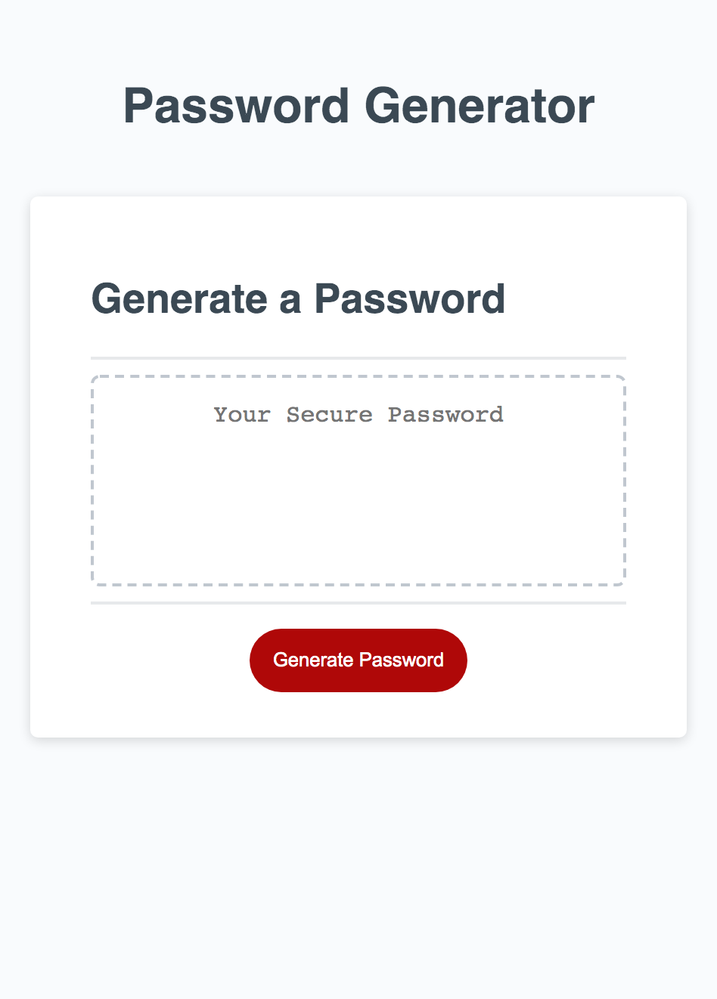

# Password-Gen
***
Title: Password Generator
***
Description: Webpage generates a password based on criteria selected by the user.
Criteria include: It's length (8 > char <128), and is the desired password to include; letters, uppercase letters, numbers and/or symbols.
***
Purpose: Generating a secure password is tricky for humans, but easily achived through javascript code. 
***
Limitations: The math.random fuction is not truly random, this does not really matter as anyone who wishes to ustilise this flaw to determine what passwords have been generated also requires many other coditions, such as wether the user actually decided to use the first password generated, the 10th or none at all.
Addtionally, the JS code gathers a "basket" of potential options as it asks the prompts. The final password is generated based on this basket, but just because an item selected in a prompt is in the basket, does not mean that that portion of the basket will be used to generate the password. It randomly selects ellements from the basket until the desired length is achived. 
***
Deployment: When the HTML, CSS and JS files are displayed by any browser the code should appear as indicated by this example image: 
The page can also be access via the folowing url: https://wollemipines.github.io/Password-Gen/
***
Changes: None, this is the first edtion. 
